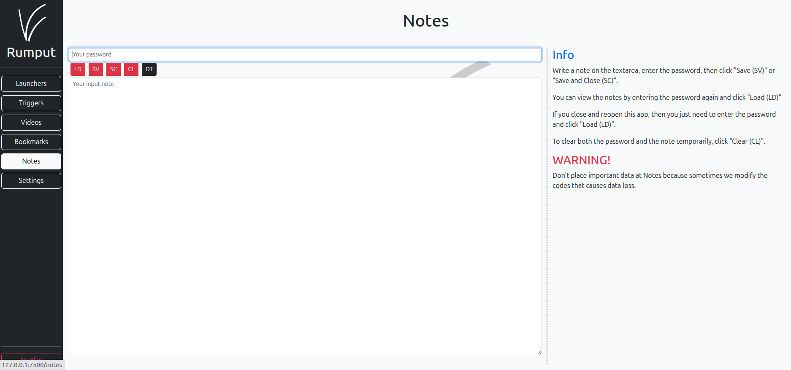
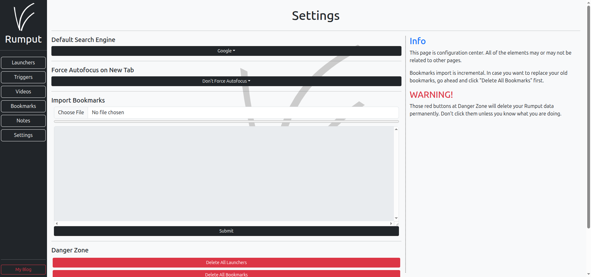

# Rumput

Personal and Multi Purpose Web Dashboard.

## TOC
- [Rumput](#rumput)
  - [TOC](#toc)
  - [Fitur](#fitur)
  - [Saran Fitur](#saran-fitur)
  - [Cara Install Menggunakan Docker](#cara-install-menggunakan-docker)
  - [Cara Install atau Develop Menggunakan Node.js dan NPM](#cara-install-atau-develop-menggunakan-nodejs-dan-npm)
  - [Jika Anda menggunakan Brave (atau ads blocker lainnya)](#jika-anda-menggunakan-brave-atau-ads-blocker-lainnya)
  - [Screenshot](#screenshot)

## Fitur

- Search Box
  - [baru] 8055 Engine
- URL Launchers
- Triggers
- Bookmarks
- Notes
- Videos
- Settings

## Saran Fitur

- Tulis saran fitur di issue tracker.

## Cara Install Menggunakan Docker

Clone repository:

```
git clone https://github.com/rakifsul/rumput.git
```

Ganti directory:

```
cd rumput
```

Docker compose up:

```
docker compose up -d --build
```

Kunjungi http://127.0.0.1:7500

## Cara Install atau Develop Menggunakan Node.js dan NPM

Port 3000 harus free kecuali di-set di env variable.

Clone repository:

```
git clone https://github.com/rakifsul/rumput.git
```

Ganti directory:

```
cd rumput
```

Install dependencies:

```
npm install
```

Run:

```
npm run dev
```

Jika Anda ingin menggunakan host dan port yang berbeda:

```
export RUMPUT_HOST=127.0.0.1 && export RUMPUT_PORT=4000 && npm run dev
```

## Jika Anda menggunakan Brave (atau ads blocker lainnya)

Rumput memiliki pilihan untuk force autofocus pada new opened tab.

Ini sedikit merepotkan jika Anda menggunakan Brave atau mungkin ads blocker lainnya.

Jika Anda menggunakan Brave atau ads blocker lainnya, **disable pop up blocker**.

Screenshot ini menunjukkan caranya.

**Perhatian:**

**Sangat tidak disarankan untuk menggunakan force autofocus jika Anda menggunakan rumput sebagai homepage tanpa memberikan izin untuk menjalankan popup. Jika itu dilakukan, maka browser akan tertutup seketika setelah dijalankan dan itu sangat rumit untuk diperbaiki.**


## Screenshot





