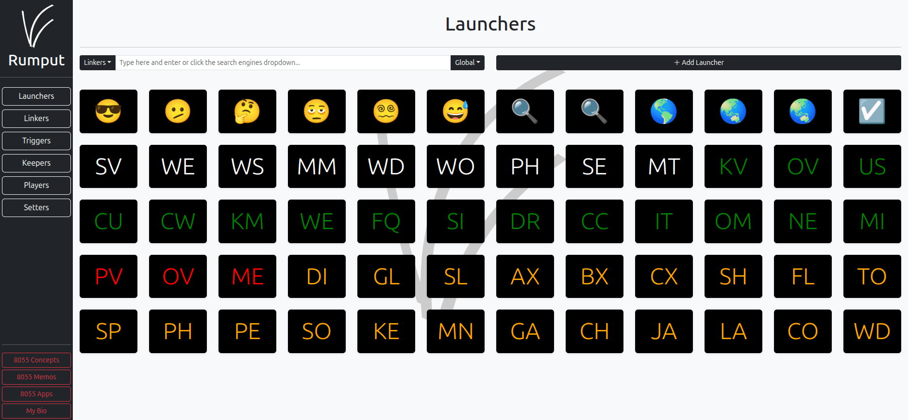
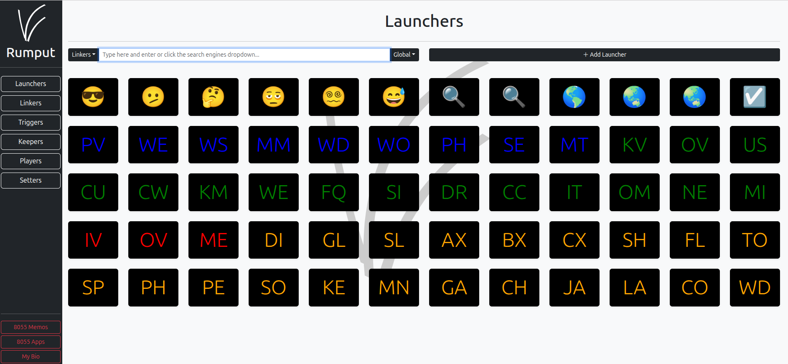
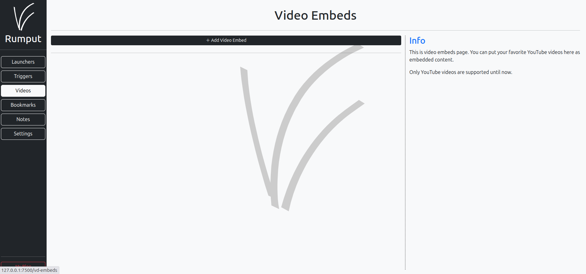
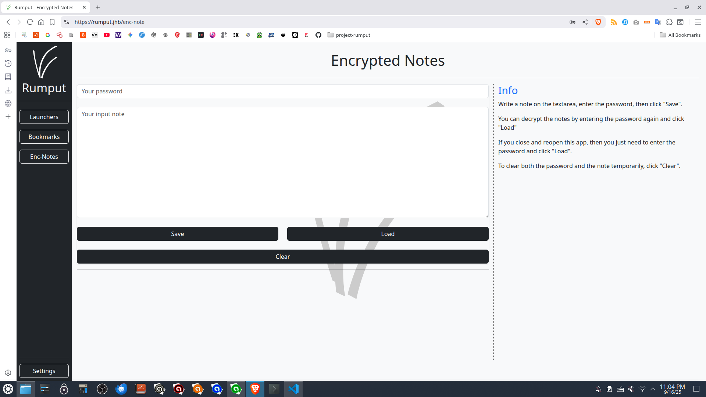

# Rumput

Personal and Multi Purpose Web Dashboard.

## Features

- Search Box
- URL Launchers
- Bookmarks
- Encrypted Notes
- Settings

## More Features

- Write your suggestions to issue tracker.

## My More Feature Ideas

- Todo List
- Password Manager
- RSS Reader
- Embed Scripts

## How to Install (using Docker)

Clone repository:

```
git clone https://github.com/rakifsul/rumput.git
```

Change directory:

```
cd rumput
```

Docker compose up:

```
docker compose up -d --build
```

Visit http://127.0.0.1:7500

## How to Develop (using Node.js and NPM)

Node.js v22.19.0 is required.

Port 3000 must be free.

Clone repository:

```
git clone https://github.com/rakifsul/rumput.git
```

Change directory:

```
cd rumput
```

Install dependencies:

```
npm install
```

Run:

```
npm run dev
```

## Screenshot









## More from RAKIFSUL

- [www.rakifsul.my.id](https://www.rakifsul.my.id)
