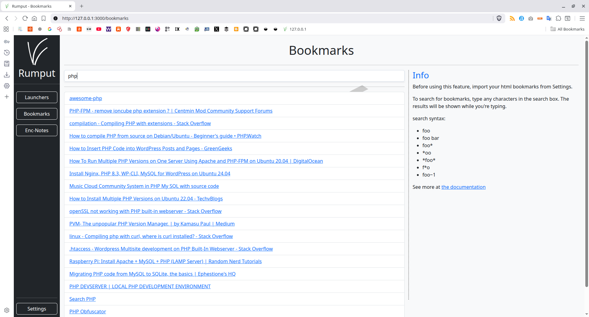
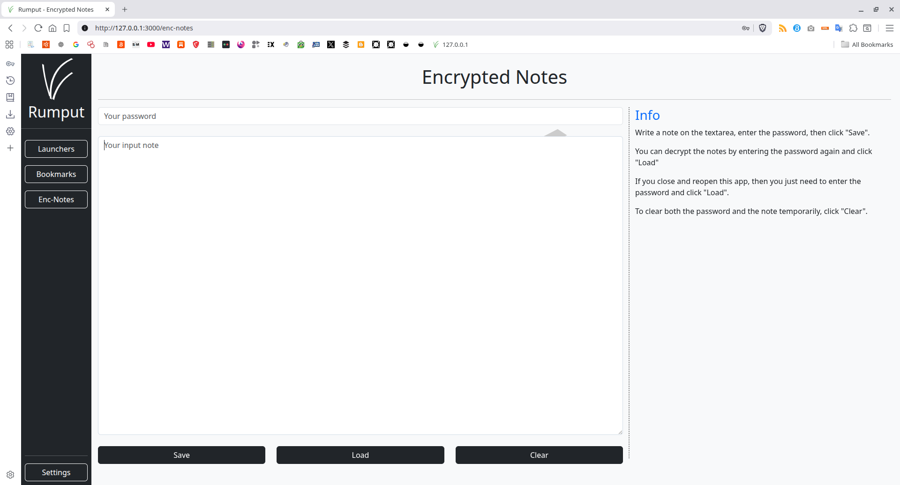
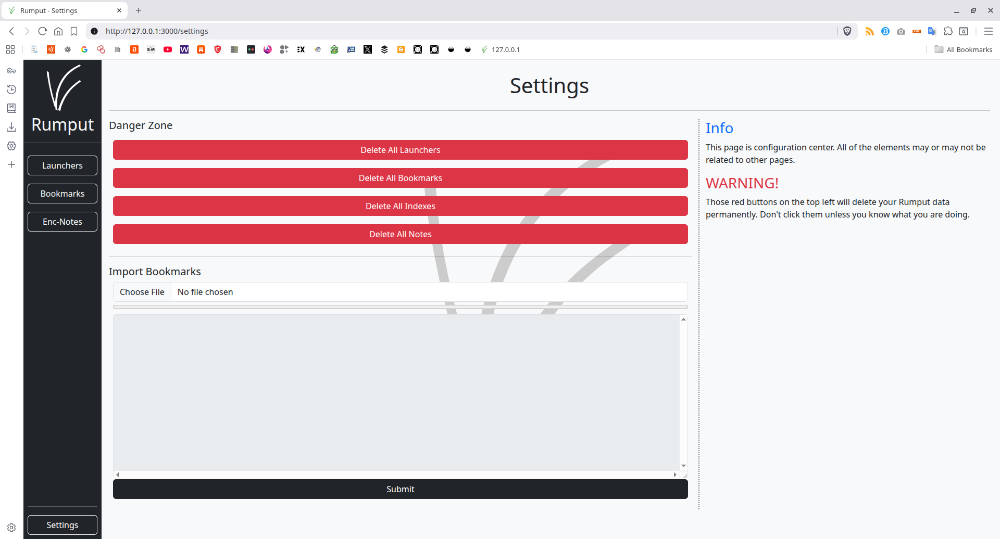

# Rumput

Personal and Multi Purpose Web Dashboard.

## TOC
- [Rumput](#rumput)
  - [TOC](#toc)
  - [Features](#features)
  - [More Features](#more-features)
  - [How to Install (using Docker)](#how-to-install-using-docker)
  - [How to Install or Develop (using Node.js and NPM)](#how-to-install-or-develop-using-nodejs-and-npm)
  - [If You are Using Brave (or any ads blocker)](#if-you-are-using-brave-or-any-ads-blocker)
  - [Screenshot](#screenshot)
  - [Get More Precious Links](#get-more-precious-links)

## Features

- Search Box
- URL Launchers
- Triggers
- Bookmarks
- Notes
- Settings

## More Features

- Write your suggestions to issue tracker.

## How to Install (using Docker)

Clone repository:

```
git clone https://github.com/rakifsul/rumput.git
```

Change directory:

```
cd rumput
```

Docker compose up:

```
docker compose up -d --build
```

Visit http://127.0.0.1:7500

## How to Install or Develop (using Node.js and NPM)

Node.js v22.19.0 probably works.

Port 3000 should be free unless it's modified on the env variable.

Clone repository:

```
git clone https://github.com/rakifsul/rumput.git
```

Change directory:

```
cd rumput
```

Install dependencies:

```
npm install
```

Run:

```
npm run dev
```

If you want to use different host and port:

```
export RUMPUT_HOST=127.0.0.1 && export RUMPUT_PORT=4000 && npm run dev
```

## If You are Using Brave (or any ads blocker)

Rumput has option to force autofocus at new opened tab.

This is a little bit tricky if you are using Brave or maybe other ads blocker.

So, if you are using Brave, **disable the pop up blocker**.

These screenshots show you how to do this.

**Warning:**

**It's not recommended to use force autofocus if you set rumput as homepage without giving permission to allow popup. Your browser will close instantly after being launched and it's really complicated to fix.**


## Screenshot









## Get More Precious Links

- [www.rakifsul.my.id](https://www.rakifsul.my.id)
